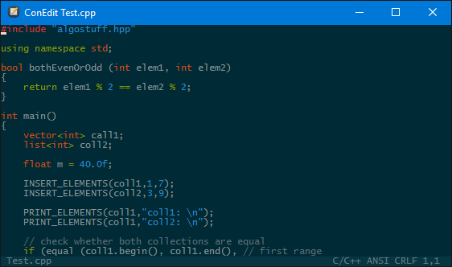
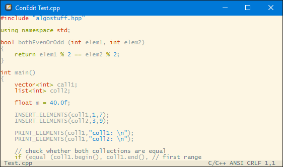

<!--  ConEdit -->
 ConEdit
==========

A simple text editor for Windows console

Theme Solarized
----------------

Features
--------
- Edit any text file
- Multi-level undo/redo
- Unicode
- Find in file
- Colour Themes
- Syntax Highlighting
